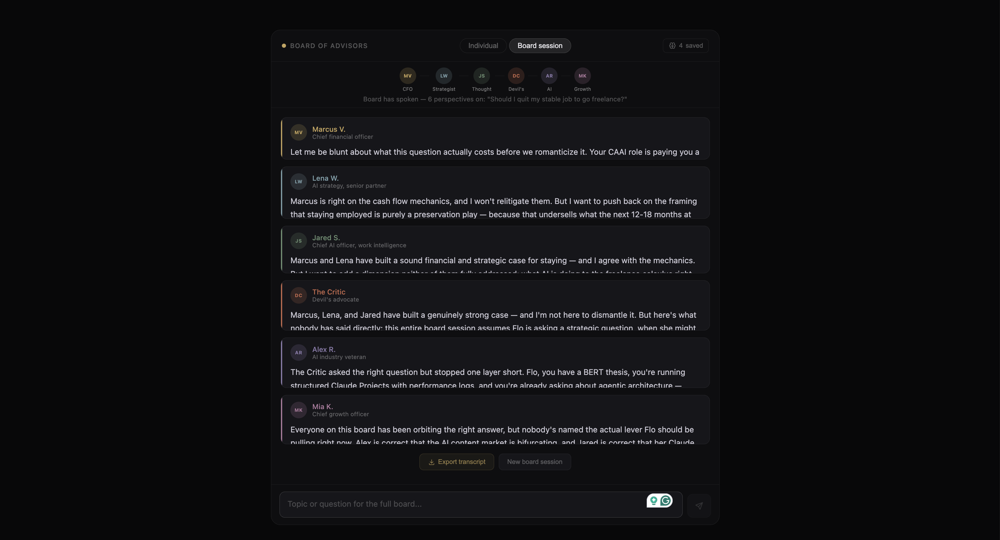

# AI Board of Advisors



Six AI advisors who don't just answer my questions. They debate them, in front of me, and then I decide.

I built this for myself. I'm navigating a lot at once right now — a content career in AI, freelance work on the side, and a move across an ocean to Germany — and the decisions kept outgrowing the advice any single person, or any single ChatGPT-style answer, could give me. I wanted a CFO who'd challenge my spending, a strategist who'd think in five-year arcs, a growth operator who wants to see things ship, and a critic whose whole job is to find the flaw before it finds me. So I built them.

The advisors know me. Not through any magic — I wrote my actual context into each of their system prompts, so they open every session already understanding who I am, what I'm working toward, and what's at stake. That's the point of the project, and it's the thing worth understanding even if you never run a line of it: **this is a personal instrument, tuned to one person's life, and reading how it's built tells you how I think about my own.**

Most "AI persona" tools run personas in parallel — six independent monologues that never touch. This one runs them in sequence. Each advisor receives the full transcript of what the advisors before them said, and is instructed to engage: agree, push back, or build. The result is intellectual friction you can't get from prompting one model six times.

Built on a deliberately minimal stack: Node.js, Express, vanilla JavaScript. No framework, no build step, no database. One command to run.

## The board

| Advisor | Lens |
|---|---|
| Marcus V., CFO | ROI, opportunity cost, forced prioritization |
| Lena W., AI Strategy Partner | Long-horizon capability plays, frameworks |
| Jared S., Chief AI Officer | AI at work, workflow transformation |
| The Critic | Stress-testing, the flaw before it finds you |
| Alex R., AI Veteran | What actually ships versus what is hype |
| Mia K., Growth Operator | Systems, compounding returns, shipping |

Each persona is defined in `advisors.js` with a distinct voice, a strategic lens, and a strict output format.

## Why the board is tuned to me (and how it "knows" things)

This is the design decision at the heart of the project, so it's worth being clear about how it works.

The app talks to the Anthropic API directly, which — unlike the Claude chat product — has no memory and no personalization. It knows nothing about anyone. So every piece of context these advisors have about me is context I deliberately wrote into their system prompts: my role, my goals, the move to Berlin, the freelance work, the specific decisions I'm weighing. When Marcus the CFO pushes back on an idea because of my runway, it's because I told him what my runway is.

That means two things. First, the "intelligence" here isn't retrieved from some profile — it's authored. The quality of the advice is a direct function of how precisely I described my own situation, which turned out to be a genuinely useful exercise in itself. Second, if you clone this and run it, the advisors will still think they're advising *me*. They won't adapt to you, because the context is written into the code, not pulled from your account.

I kept it that way on purpose. A generic advice bot is a commodity. A board that's been carefully calibrated to one real person's actual life is a portrait — of the decisions I'm making, the lenses I find useful, and how I think about turning a messy situation into something a system can reason about. If you're reading this to understand how I work, `advisors.js` is the most honest file in the repo. (The obvious next version lets a new user inject their own context at startup instead of using mine — noted in [Future directions](#future-directions).)

## Quick start

Requires [Node.js 18+](https://nodejs.org). No other tooling.

```bash
npm install
cp .env.example .env      # then paste your Anthropic API key into .env
npm start
```

Open http://localhost:3000. Get an API key at [console.anthropic.com](https://console.anthropic.com). Your key stays in `.env` on your machine; it is gitignored and never reaches the browser.

## How a board session works

```
Topic from user
      |
      v
Advisor 1 (opens cold) ──────────────┐
      |                              |
      v                              |
Advisor 2 (sees Advisor 1) ──────────┤
      |                              |  running
      v                              |  debate
Advisor 3 (sees 1 + 2) ──────────────┤  log
      |                              |
     ...                             |
      v                              |
Advisor 6 (sees all five) ───────────┘
      |
      v
Exportable markdown transcript
```

The frontend makes six sequential calls to `POST /api/chat`. The server injects the accumulated debate log into each advisor's system prompt, so advisor four can tell advisor two they're wrong, specifically and by name. After the round completes, the session exports as a timestamped markdown transcript.

## Architecture decisions

**The API key never touches the browser.** All Anthropic calls go through the Express server. The frontend only ever talks to `/api/*`. This is the correct pattern for any AI-powered web app, personal or not.

**Advisor IDs are validated before touching the filesystem.** Session routes build file paths from URL parameters, so IDs are checked against the known advisor list first. Unvalidated path parameters are a classic path traversal vector.

**Flat JSON over a database.** Sessions are date-keyed files per advisor; memories are a capped array (last 25 entries) in `memories.json`. A database would be premature for single-user, low-write data. The `data/` directory is gitignored, so every user gets their own local state.

**No frontend framework.** One HTML file, no build pipeline, nothing to maintain. The DOM update pattern appends advisor cards individually during board sessions rather than re-rendering, so the progress indicator stays fixed while responses arrive below it.

## API

| Method | Route | Purpose |
|---|---|---|
| POST | `/api/chat` | Proxies to the Anthropic API with the advisor's system prompt |
| GET | `/api/advisors` | Advisor metadata (system prompts stripped) |
| GET | `/api/sessions/:advisorId` | Most recent saved conversation |
| POST | `/api/sessions/:advisorId` | Save today's conversation |
| DELETE | `/api/sessions/:advisorId` | Clear an advisor's sessions |
| GET / POST / DELETE | `/api/memory` | Read, append, or remove persistent board memories |
| POST | `/api/board-sessions` | Archive a completed board debate |

Model and token limits live in `config.js`.

## Why this runs locally, not hosted

A deliberate decision. This app has no authentication layer, and the Anthropic API key lives server-side. Hosting it publicly would mean anyone with the URL could run board sessions against my API budget. Adding auth would solve that, but for a personal advisory tool it's complexity without payoff.

So the deployment model is: clone it, add your own key, run it on your machine. Your usage, your key, your data. Serverless functions were prototyped and cut for a second reason: they have no persistent filesystem, which kills the cross-session memory feature that makes the board worth returning to.

## Making it yours

This board is tuned to me, but the structure is meant to be forked. Every advisor is an object in `advisors.js`: an ID, display metadata, suggested prompts, and a system prompt. To build your own board, rewrite those system prompts with your context and your advisors, then restart. Each prompt follows a consistent structure worth keeping: who the advisor is, who they're advising and with what context, their voice, and a strict output format. Swap my life for yours and the machine works exactly the same.

## Future directions

The most interesting extension is making the context dynamic. Right now my situation is hardcoded into every system prompt. The natural next version adds a short setup step where a user enters their own role, goals, and the decision they're weighing, and the app injects *that* into each advisor at runtime — same six lenses, personalized to whoever's asking. It's a small architectural change with a big conceptual payoff: it's the difference between a hardcoded prompt and a dynamic one, which is most of what "building with AI" actually is.

Other things I'd add: a final synthesis round where a seventh call summarizes where the board agreed and disagreed; streaming responses so advice appears as it's written rather than all at once; and follow-up questions within a board session so a debate can go a second round.

## Built by

[Florence Ukeni](https://florence-ukeni.netlify.app), Content Manager at the Center for Applied AI at the University of Chicago Booth School of Business. I translate complex AI research for broad audiences by day; this is one of a series of working AI systems I build to understand implementation from the inside — persona architecture, sequential agent chaining, server-side prompt construction, and the practical patterns of putting a language model into a real application. MIT licensed.
